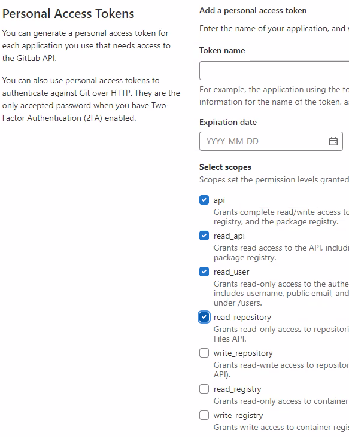
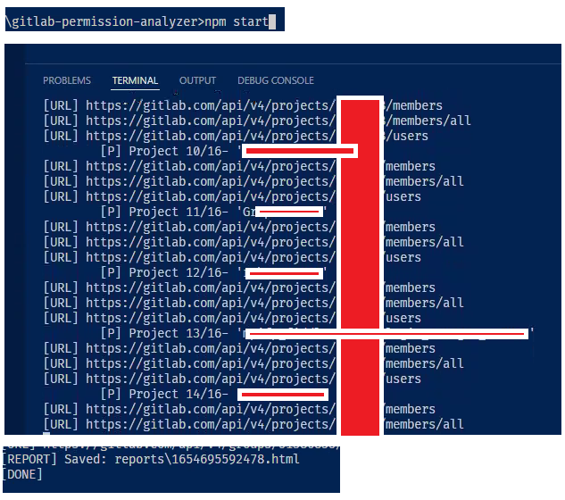
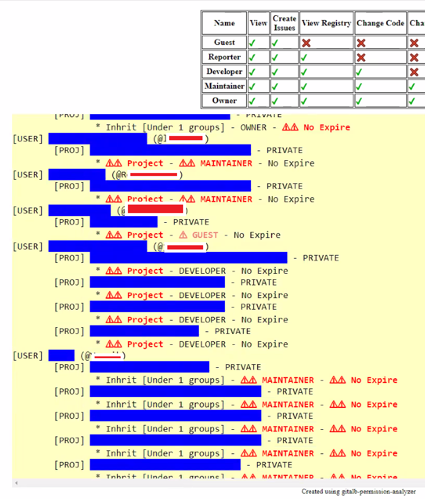

# Gitlab Permission Analyzer

A tool to produce a simple report about users and what repos they can access. Should be run with the most upper administrator access token

Also, a simple presentation about GitLab permission concepts and Gitlab APIs used: [gitlab-permission-analyzer.pdf](./doc.files/gitlab-permission-analyzer.pdf)

## How to run

1. Put the token in the `.env` file (see sample file `.env.sample`)
2. run `npm install`
2. Run `npm start`
3.  the report in the `reports` folder.

## Example with images

### Create Access token (with admin user )



### Run `npm start` to generate a report



## Censored Example result (JSON)

This Can used to backup-clone all repos with the following snippet: [get.backup.shell.js](get.backup.shell.js)

```json
[
    {
        "user": "yonixw",
        "nick": "****************",
        "projects": []
    },
    {
        "user": "*****",
        "nick": "****************",
        "projects": [
            {
                "fullurl": "https://gitlab.com/***/****/ui",
                "name": "**** / ***** / Ui",
                "expire": null,
                "visibility": "private",
                "directmember": false,
                "accessgroupcount": 2
            }
        ]
    }
]
```

## Example result (HTML)



